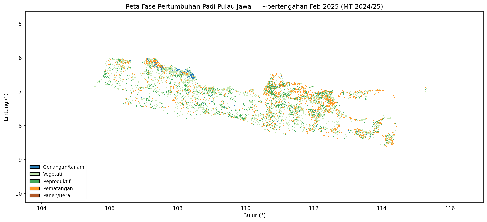

::: {.text-end}
🌐 [English →](../growth-phase.qmd) · **Bahasa Indonesia**
:::

## Keterbatasan fase hanya-VH

Penghitung siklus pada bab [indeks pertanaman](planting-index.qmd) memberi tahu Anda *berapa banyak*
siklus terjadi, tetapi mengklasifikasikan **tahap tumbuh yang tepat** (genangan → vegetatif →
reproduktif → pemasakan) dari **VH saja** itu sulit: tahap reproduktif tumpang-tindih dalam
hamburan-balik, dan lahan tadah-hujan tanpa lembah genangan yang jelas kehilangan jangkar fenologisnya.
Pada data lapangan, model fase berambang hanya-VH hanya mencapai kesepakatan ~32%.

{width=90%}

## Menambah optik: fusi Sentinel-1 + Sentinel-2 (MOGPR)

**NDVI** Sentinel-2 membawa informasi fenologi yang kuat tetapi terputus oleh awan di daerah tropis
lembap. **MOGPR** (*Multi-Output Gaussian Process Regression*, dari perangkat sumber-terbuka
[FuseTS](https://github.com/Open-EO/FuseTS)) memfusikan keduanya: ia memakai korelasi-silang antara VH
dan NDVI untuk mengisi celah dan menghasilkan satu kurva terfusi bebas-celah per piksel, yang lalu
dilabeli menurut fase oleh pengklasifikasi deret-waktu (MiniROCKET + LightGBM).

Dalam evaluasi proyek (*leave-one-region-out*, titik berlabel drone), menambahkan optik lewat MOGPR
menaikkan F1 fase generatif dari **0,52 (hanya-VH) → ~0,67 (terfusi)** — sekitar +15 poin. Ternyata,
optiklah penentu tahap fenologis; radar menyediakan tulang punggung segala-cuaca.

::: {.callout-note}
## Sumber-terbuka, bukan berpemilik
FuseTS/MOGPR adalah alternatif gratis dan dapat direproduksi terhadap layanan fusi berpemilik (mis.
CropSAR) — penting bagi lembaga nasional dengan anggaran publik.
:::

## Di mana kode fusi berada

Alur fusi (kubus data, MOGPR, pengklasifikasi fase, peta fase/IP/produksi multi-tahun) berada di
repositori terpisah:

- **[github.com/firmanhadi21/FuseTS](https://github.com/firmanhadi21/FuseTS)** — lihat
  `scripts/extract_point_series.py`, `scripts/train_v3_mogpr_ensemble.py`, dan
  `scripts/ABLATION_HPC_RUNBOOK.md`.

Ia memerlukan akses Sentinel-2 (Microsoft Planetary Computer) dan komputasi lebih besar daripada
tutorial laptop ini, itulah sebabnya disajikan di sini sebagai perluasan alih-alih langkah yang bisa
dijalankan.

## Rangkuman

Kini Anda telah melihat keseluruhan sistem:

1. **Peta sawah** — fenologi VH + pengklasifikasi SMOTE + konsensus lintas tahun.
2. **Indeks pertanaman** — penghitungan siklus berbasis data (1×/2×/3×).
3. **Kinerja irigasi** — Kc + neraca air → SI/CU/RI per petak tersier.
4. **Fase tanam** — fusi MOGPR S1+S2 untuk pemetaan tahap yang akurat (perluasan).

Bersama-sama, semua itu mengubah citra radar gratis menjadi informasi siap-keputusan untuk pengelolaan
irigasi. Terima kasih telah mengikuti — isu dan kontribusi dipersilakan di
[GitHub](https://github.com/firmanhadi21/s1-rice-irrigation-tutorial).
