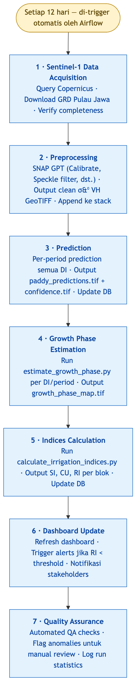
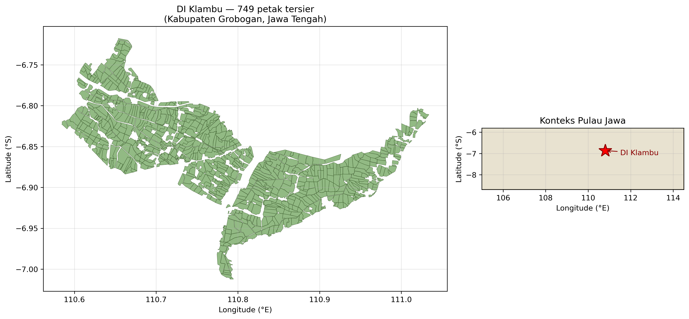
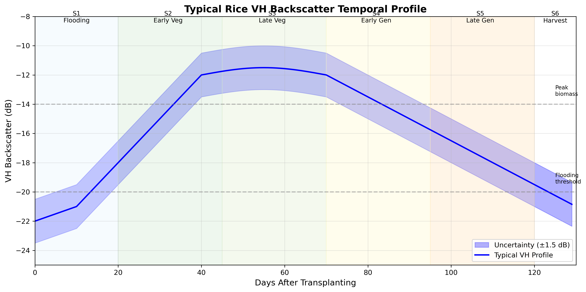

::: {.text-end}
🌐 **English** · [Bahasa Indonesia →](id/index.qmd)
:::

This tutorial walks you, end to end, through a satellite workflow that turns **Sentinel-1 radar
time series** into three operational products for water-resources management:

::: {.grid}

::: {.g-col-12 .g-col-md-4}
### 🌾 Paddy-field map
Detect rice paddies from VH backscatter phenology with an SMOTE-balanced neural network, and
build a multi-year **stable-paddy consensus**.

[Go to chapter →](paddy-map.qmd)
:::

::: {.g-col-12 .g-col-md-4}
### 📅 Planting index
Count complete flood→canopy **cropping cycles** per year (1×/2×/3×) to map cropping intensity —
the "luas musim tanam".

[Go to chapter →](planting-index.qmd)
:::

::: {.g-col-12 .g-col-md-4}
### 💧 Irrigation performance
Turn the maps into **per-tertiary-block indices** — Satisfaction (SI), Uniformity (CU), and
Reliability (RI) — for a Daerah Irigasi.

[Go to chapter →](irrigation-performance.qmd)
:::

:::

## What you will build

By the end you will have reproduced, over a small sample area, the full chain:

1. A **VH time-series stack** for an area of interest (AOI), fetched from the cloud.
2. A **binary paddy map** and a **multi-year consensus** of stable paddy.
3. A **cropping-intensity (planting-index)** map.
4. A **crop-coefficient (Kc)** map linking phenology to water demand.
5. **Irrigation-performance indices (SI/CU/RI)** per tertiary block for **DI Klambu**.

## The sample area of interest

To keep everything runnable without a supercomputer, the tutorial centres on **DI Klambu**
(Grobogan, Central Java) — the project's flagship irrigation district (10,700 ha, 653 tertiary
blocks). Its tertiary-block boundaries and reference outputs ship with the repository, and the
Sentinel-1 stack for the AOI is small enough to fetch on a laptop.

{width=85%}

## How the workflow is structured

The method rests on the **distinctive VH backscatter signature of rice**: very low during
flooding/transplanting, rising sharply through the vegetative stage to a canopy peak, then falling
towards harvest. That six-stage pattern — captured every 12 days by Sentinel-1 — is what every
product below is built on.

{width=85%}

## Prerequisites

- Comfortable with the **Linux/macOS command line** and basic **Python**.
- A free **Google Earth Engine** account (to fetch the sample Sentinel-1 stack), *or* your own
  pre-processed VH stack.
- ~4 GB RAM and a few GB of disk. **No GPU required** — the models run on CPU.

Start with the [**Setup**](setup.qmd) chapter to install the environment and fetch the sample data.

::: {.callout-note}
## Scope & honesty
This is a *methods* tutorial. The full Java-scale products in the reports were produced on an HPC
from ~1,000 Sentinel-1 scenes; here you reproduce the **same methods** on a small AOI. Accuracy
figures quoted are from the full study, not the toy sample.
:::
