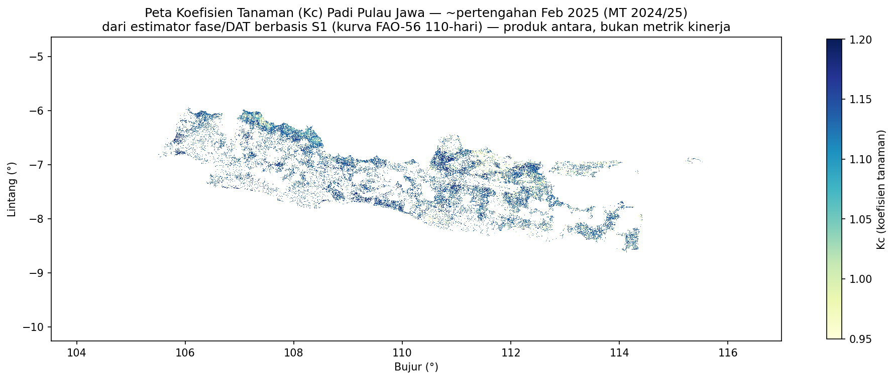
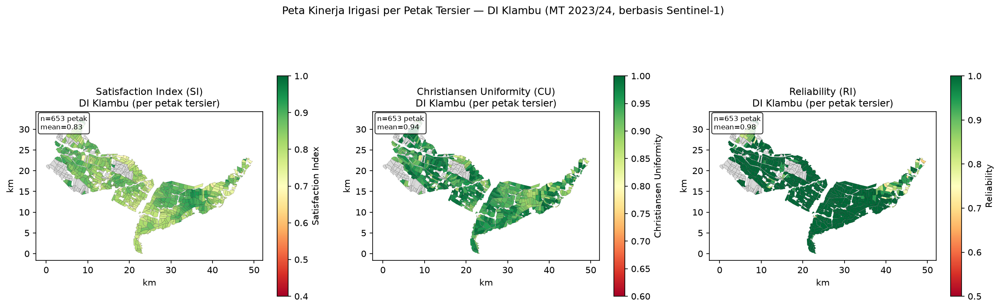

::: {.text-end}
🌐 **English** · [Bahasa Indonesia →](id/irrigation-performance.qmd)
:::

## The idea

The final step turns the satellite maps into **operational irrigation indicators** for a
*Daerah Irigasi* (DI), computed **per tertiary block** (petak tersier). Three standard indices
(FAO / Bos 1985) summarise how well the network delivers water:

| Index | Meaning | Question it answers |
|---|---|---|
| **SI** — Satisfaction Index | *adequacy* | Is each block getting enough water? |
| **CU** — Christiansen Uniformity | *uniformity* | Is water spread evenly across the DI? |
| **RI** — Reliability Index | *dependability* | Does each block stay adequate over time? |

We demonstrate on **DI Klambu** (Grobogan, Central Java; 653 tertiary blocks), whose block
boundaries and reference results ship with the repository.

::: {.callout-important}
## What this chapter demonstrates vs the full method
To stay laptop-runnable, the steps below build the water balance from **Sentinel-1** (crop
coefficient / Kc) plus **CHIRPS rainfall and reference ET**. The full operational method also
**fuses Sentinel-2 and Landsat optical** imagery to estimate ET / Kc more accurately — that
multi-sensor fusion is the production upgrade, kept out of this hands-on chapter so it remains
reproducible on a laptop.
:::

## Step 1 — Crop water demand: the Kc map

Growth phase → **crop coefficient (Kc)** links what the satellite sees to how much water the crop
needs. `produce_kc_map.py` estimates days-after-transplant from the VH flooding trough and maps it
onto the FAO-56 rice 110-day curve (Kc 1.05 → 1.20 → 0.95 → 0).

Pass your VH stack and paddy mask with `--stack` / `--paddy-mask`. `--period-band` is the **band
index** to target (it uses that band plus the 9 before it, so it needs ≥10 bands of history — with
the 18-band sample, use 10–18):

```bash
python produce_kc_map.py --period-band 14 --out kc_sample \
    --stack data/sample/klambu_vh_2024.tif \
    --paddy-mask consensus_sample/consensus_paddy_map.tif
# → kc_sample/kc_band14.tif  (Kc per active-paddy pixel)
```

{width=90%}

::: {.callout-note}
## Expect a sparse result on the toy AOI
Because the sample paddy mask is small (and built from just a few periods), the Kc map — and the
indices downstream — may cover very few pixels. The steps below demonstrate the *mechanics*, not a
representative result; use a fuller multi-year stack and more periods for meaningful output.
:::

## Step 2 — Water balance (rainfall vs demand)

The Satisfaction Index compares **supply** (rainfall — and, where available, gate/staff-gauge
flows) against **demand** (Kc × reference evapotranspiration). The project uses CHIRPS rainfall and
ET; the shipped daily series for Klambu live in `2026/irrigation_performance/` and
`2026/irrigation_performance_2024_s1kc/`.

::: {.callout-note}
## Satellite-only vs water-referenced SI
Without gate-sensor data, SI is computed from **active-paddy detection** (a satellite proxy for
adequacy). Referencing SI to *actual* water (gate openings) is the field-validation step planned
for a later campaign — see the reports. Be explicit about which you report.
:::

## Step 3 — Compute SI / CU / RI per block

`calculate_irrigation_indices.py` ties it together — it reads your per-period paddy predictions and
the tertiary-block boundaries (`klambu.gpkg`, block-id field `norec`), zonally aggregates the active-
paddy signal, and writes the three indices per block.

```bash
python calculate_irrigation_indices.py \
    --predictions-dir predictions_sample/2024 \
    --periods 13 15 17 19 21 23 \
    --di-boundary 2026/irrigation_performance/klambu.gpkg \
    --output-dir irrigation_results/klambu_2024 \
    --confidence-threshold 0.7
```

Outputs include per-block index CSVs, a DI-level summary, and time-series/histogram quick-looks in
`irrigation_results/klambu_2024/`.

The repository already ships reference results you can inspect immediately:

```bash
head 2026/irrigation_performance/reliability_block_results.csv
cat 2026/irrigation_performance/performance_summary.txt
```

## Step 4 — Map the indices per block

`make_irrigation_maps.py` renders the three choropleth panels. It reads the per-block CSVs from
`./results_csv/` (a fixed location) and joins them to `klambu.gpkg`. The quickest way to see it is
with the **shipped reference results**:

```bash
mkdir -p results_csv
cp 2026/irrigation_performance/uniformity_block_results.csv results_csv/
cp 2026/irrigation_performance/reliability_block_results.csv results_csv/
python make_irrigation_maps.py
# → writes 2026/figures/fig_irrigation_klambu_maps.png
```

(To map *your* run instead, copy the CSVs produced in Step 3 into `results_csv/` before running.)

{width=100%}

## Reading the result

For DI Klambu the full study finds:

| Index | Value | Category (FAO/Bos 1985) |
|---|---|---|
| SI | 0.83 | Very good |
| CU | 0.93 | Very good |
| RI | 0.98 | Very good |

But the operationally useful output is the **spatial diagnostic**: the system flags **10 problematic
blocks** (RI < 0.75), **7 of them at the tail-end** of the tertiary network — the classic head–tail
inequity. Instead of inspecting all 653 blocks, the BBWS can target those 10 — the core value
proposition of a satellite approach.

::: {.callout-tip}
## Suggested performance thresholds (P3A contracts)
A tiered scheme lets adoption start conservative and tighten over time. Tier 1: **SI ≥ 0.75, CU ≥
0.80, RI ≥ 0.70**, plus cropping index **≥ 1.5**.
:::

## Where to go next

You have reproduced the full chain on a sample DI. To scale up you would: process more Sentinel-1
periods and years, extend to more DIs, and — the key upgrade — add **field validation** to
water-reference SI and calibrate the phase algorithm.

For the more accurate **growth-phase** product that underpins Kc, continue to
[Going further: S1+S2 fusion](growth-phase.qmd).
