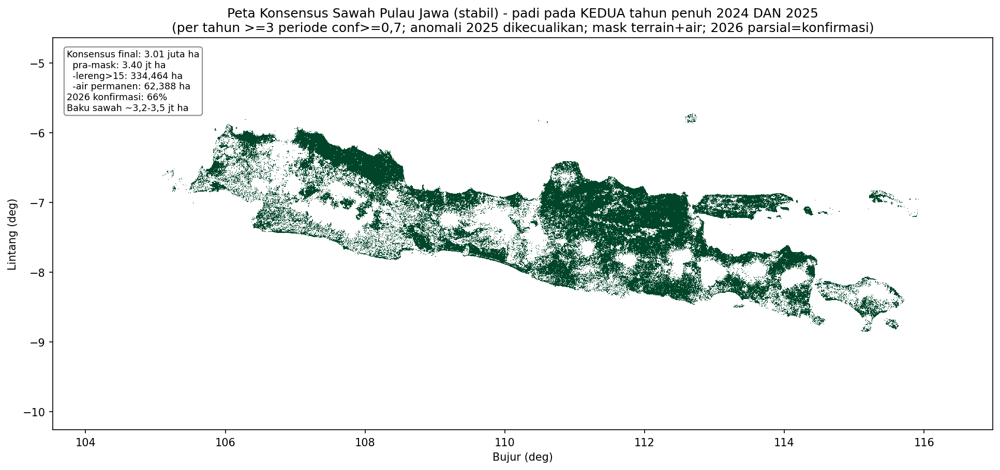
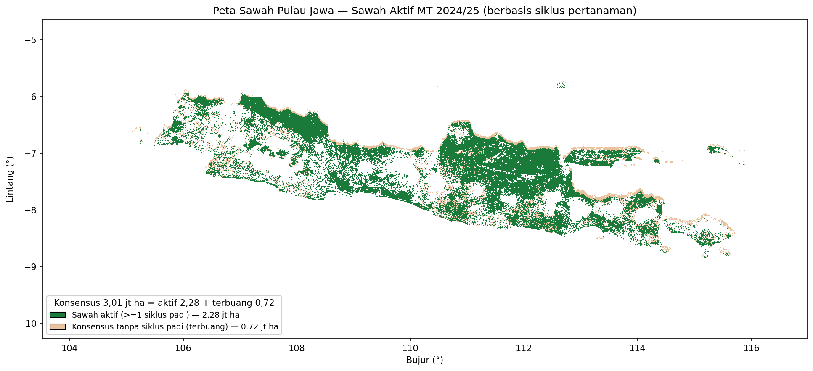

## The idea

Rice paddies have a distinctive **VH backscatter trajectory** — a deep flooding trough followed by
a steep vegetative rise to a canopy peak. We turn a 7-period window of VH values into **29
engineered features** (temporal values, differences, ratios, and phenology indicators) and classify
each pixel as *paddy / non-paddy*.

Because paddy hugely outnumbers non-paddy in the training points (≈92% vs 8%), a naive model becomes
over-conservative. We fix this with **SMOTE** (synthetic minority over-sampling) to a balanced 50/50
set — the single most important step for realistic detection.

## Step 1 — Train the model (runs from shipped data)

The repository ships pre-extracted features, so training needs **no satellite data**:

```bash
export CUDA_VISIBLE_DEVICES=-1
python train_paddy_vh_smote.py
```

What happens:

- loads `model_files_paddy_vh/training_data_*.csv` (29 VH features per point),
- applies **SMOTE** to balance the classes,
- trains an MLP with 5-fold stratified cross-validation,
- writes `model_files_paddy_vh/paddy_vh_model.keras` + `scaler.joblib`.

Expected cross-validation performance (full study):

| Metric | Value |
|---|---|
| Accuracy | 95.4% ± 0.2% |
| AUC-ROC | 98.3% ± 0.1% |

::: {.callout-tip}
A trained model already ships in `model_files_paddy_vh/` — you can **skip training** and go
straight to prediction.
:::

## Step 2 — Predict on the AOI stack

Point the predictor at the Sentinel-1 stack you fetched in [Setup](setup.qmd). Because the sample
stack is a single year starting at band 1, use `--year-start-band 1` and set `--year-periods` to the
number of bands you downloaded (periods 7–24 → 18 bands).

```bash
python predict_paddy_vh_multiyear.py \
    --period 15 --year 2024 \
    --year-start-band 1 --year-periods 18 \
    --vh-stack data/sample/klambu_vh_2024.tif \
    --mask data/sample/klambu_mask.tif \
    --skip-test \
    --output-dir predictions_sample/2024/period_15
```

Outputs (per period):

```
predictions_sample/2024/period_15/
├── paddy_predictions.tif   # 0 = non-paddy, 1 = paddy
├── confidence.tif          # 0–1 probability
├── paddy_map.png           # quick-look
└── statistics.txt          # area + confidence summary
```

::: {.callout-important}
## Feature window needs history
The 29 features use the current period **plus the 6 previous** periods. Predict on periods where at
least 7 prior bands exist (e.g. period 13+ if your stack starts at period 7). For earlier periods,
fetch a stack that starts earlier.
:::

Batch several periods to see the season evolve:

```bash
for p in 13 15 17 19 21 23; do
  python predict_paddy_vh_multiyear.py --period $p --year 2024 \
    --year-start-band 1 --year-periods 18 \
    --vh-stack data/sample/klambu_vh_2024.tif --mask data/sample/klambu_mask.tif \
    --skip-test --output-dir predictions_sample/2024/period_$p
done
```

## Step 3 — Multi-year consensus (stable paddy)

A single period includes transient false positives. The **consensus** keeps only pixels detected
as paddy consistently — ideally across two full years, with confidence and detection-count
thresholds. With one sample year you can still build a within-year consensus:

```bash
python create_multiyear_composite_paddy.py \
    --years 2024 \
    --periods 2024:"13 15 17 19 21 23" \
    --predictions-dir predictions_sample \
    --output consensus_sample \
    --min-years 1 --min-detections 3 \
    --min-confidence 0.7 --min-mean-confidence 0.6
```

The `--periods` flag takes one `YEAR:"p1 p2 ..."` argument per year and is repeatable — e.g. for the
full two-year consensus: `--periods 2024:"7 9 11" --periods 2025:"7 9 11" --min-years 2`.

The consensus rules that matter:

- `--min-confidence 0.7` — each detection must be confident,
- `--min-detections 3` — must recur across ≥3 periods,
- `--min-years 2` (full study) — must appear in **both** years → filters transient false positives.

On the full Java stack this yields the headline **stable-paddy map**:

{width=90%}

## From "detected" to "cultivated": the cycle-based map

Consensus marks *persistence*; it does not check that a pixel truly completed a rice **cycle**. The
recommended end-product intersects the consensus with a **≥1 complete flood→canopy cycle** test
(see the [Planting index](planting-index.qmd) chapter) — this rejects persistent non-rice
false positives (e.g. highland plantations) and yields the *active-paddy* map.

{width=90%}

Next: turn the temporal signal into a **planting index** → [Planting index](planting-index.qmd).
