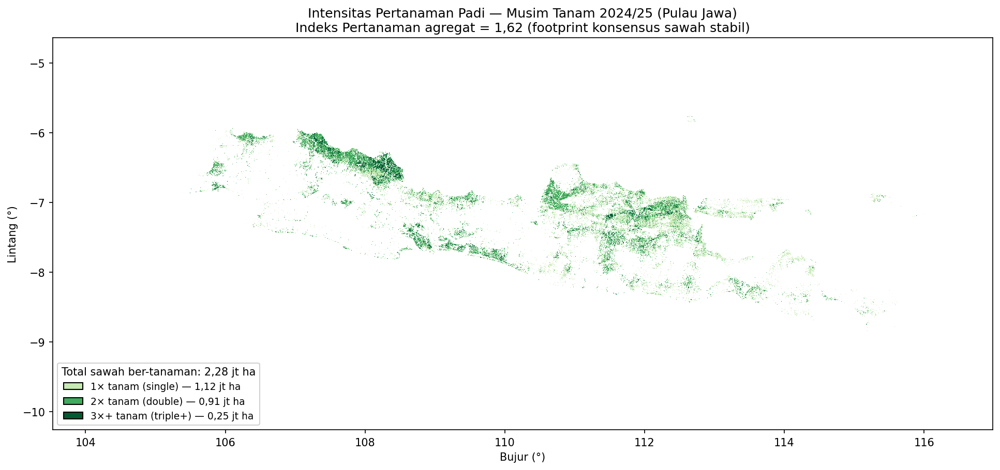

::: {.text-end}
🌐 **English** · [Bahasa Indonesia →](id/planting-index.qmd)
:::

## The idea

The **planting index** (cropping intensity, *indeks pertanaman*) answers *how many times* a field
is planted in one agricultural year. We derive it directly from the VH time series with a
**data-driven cycle counter**: no fixed calendar, no absolute-dB threshold.

Each rice cycle is a **flood trough → canopy peak** swing. A per-pixel state machine walks the time
series and counts a cycle whenever VH rises by at least a minimum amplitude (≈4 dB) above a running
minimum, then re-arms after it falls back down. The number of complete cycles **is** the planting
index for that pixel (reported 1 / 2 / 3+).

::: {.callout-note}
## Why cycle-counting, not period-counting
Counting periods a pixel "looks like paddy" over-counts (transient look-alikes inflate it).
Requiring a full flood→canopy amplitude swing is physically grounded and rejects those artefacts.
:::

## Step 1 — Validate the counter (optional)

`cropping_intensity.py` can sanity-check its vectorized counter against an independent rice map
(single/double/triple classes) before running on your stack:

```bash
python cropping_intensity.py --mode validate \
    --stack data/sample/klambu_vh_2024.tif        # or your own multi-year stack
```

The mean detected cycles should increase monotonically from the single- to the triple-crop
reference class — evidence the counter tracks real intensity. Verified output on the full Java
stack:

```
Open-SEA CI=1: n=400 mean detected=1.77
Open-SEA CI=2: n=400 mean detected=2.06
Open-SEA CI=3: n=400 mean detected=2.31
```

## Step 2 — Compute cropping intensity on the AOI

Run the full mode on your AOI stack. The **candidate mask** makes the result rice-specific — use
your paddy consensus (recommended) or a baku-sawah/cadastre layer; without one, use `--no-candidate`
(cycles only, less specific).

```bash
python cropping_intensity.py --mode full \
    --stack <your-multi-year-vh-stack.tif> \
    --candidate-mask consensus_sample/consensus_paddy_map.tif \
    --output cropping_intensity_sample
```

::: {.callout-important}
## Full mode needs a multi-year stack
`--mode full` counts cycles over the **MT 2024/25 agricultural-year window**, which the script reads
from **bands 25–56** of the combined 2024–2026 stack. The small single-year sample AOI (18 bands)
does *not* cover that window — point `--stack` at your full multi-year stack, or edit `MT_BANDS` in
the script for a different band range. The `--mode validate` step above **does** run on the sample.
:::

::: {.callout-note}
## Expect a sparse result on the toy AOI
On the small single-year sample, the within-year consensus mask (few periods, strict thresholds)
can be nearly empty, so the cropping-intensity map here is **sparse and illustrative only** — it
shows the *mechanics*, not a representative product. For a meaningful map, use more periods and the
full multi-year stack.
:::

Outputs:

```
cropping_intensity_sample/
├── cropping_intensity.tif   # uint8: 0 non-paddy, 1 / 2 / 3(=3+) crops
├── paddy_mask.tif           # 1 where ≥1 cycle
└── statistics.txt           # area per class + aggregate index
```

`statistics.txt` reports the **aggregate cropping index** (mean cycles over paddy) and the ha in
each class.

::: {.callout-warning}
## Two things the script handles for you
1. **Anomalous ~0 dB bands** (acquisition/processing gaps) are auto-detected and interpolated —
   two such bands otherwise fake an extra canopy swing and inflate the index.
2. **Pixel area** at 50 m ≈ **0.25 ha**; the script uses this, so areas are correct.
:::

## What the full study shows

On Java for MT 2024/25, the aggregate index is **≈1.62** on the stable-consensus footprint, with a
clear spatial pattern — triple-cropping concentrates along water-secure corridors (Pantura,
Bengawan Solo).

{width=95%}

An inter-annual comparison on identical pixels rose from **IP 1.45 (MT 2023/24) → 1.63 (MT
2024/25)** — the planted *area* barely changed, but *intensity* went up (more double- and
triple-cropping), consistent with post-El-Niño water recovery. That signal — climate variability
driving cropping intensity — is the scientifically interesting part of the multi-year record.

## Choosing the footprint

The cropping-intensity extent depends on the candidate mask you pass:

- **your consensus mask** → the map nests inside your paddy map (recommended, coherent);
- **a cadastre/baku-sawah mask** → the map is clipped to the official footprint;
- **`--no-candidate`** → cycles over all land (rejects nothing non-rice — use with care).

Keep the footprint consistent with the paddy map so the two products tell one story.

Next: convert phenology into **water demand** and compute **irrigation performance** →
[Irrigation performance](irrigation-performance.qmd).
